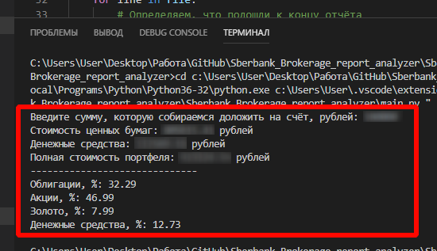

# Sberbank_Brokerage_report_analyzer

Анализируем HTML-отчёт, присылаемый Сбербанком по эл.почте

Что сделано:
- Подтягивание данных из HTML-файла
- Ввод планируемой к вложению дополнительной суммы
- Расчёт процентных долей типов активов (с учётом введённой суммы)
- Функционал целевых параметров портфеля (доли активов)
- Рекомендации по покупкам/продажам для достижения планируемых пропорций активов
- Сколько процентов составляют акции конкретного эмитента от стоимости всех акций
- Анализ портфеля акций на основе секторов (сектора берутся отсюда https://smart-lab.ru/forum/sectors/)
- Анализ облигаций (%% ОФЗ, Субъекты, Корпоративные)
- Вывод результата в консоль

В настоящее время результат работы скрипта выглядит так:

Ближайшие цели:
- Вынести конфигурацию в отдельный файл:
  - Путь к файлу
  - Целевые параметры портфеля

Планируемые возможности:
- Вывод результатов в Excel-файл

Требования для работы скрипта:
- Python (у меня установлен 3.6.4, но думаю будет и на более старых версиях работать)
- Pandas
- BeautifulSoup
- Окружение для работы со скриптом (по идее можно и в голом Python запустить скрипт, но я запускаю/отлаживаю скрипт в Visual Studio Code)